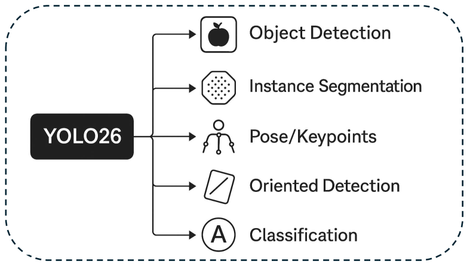
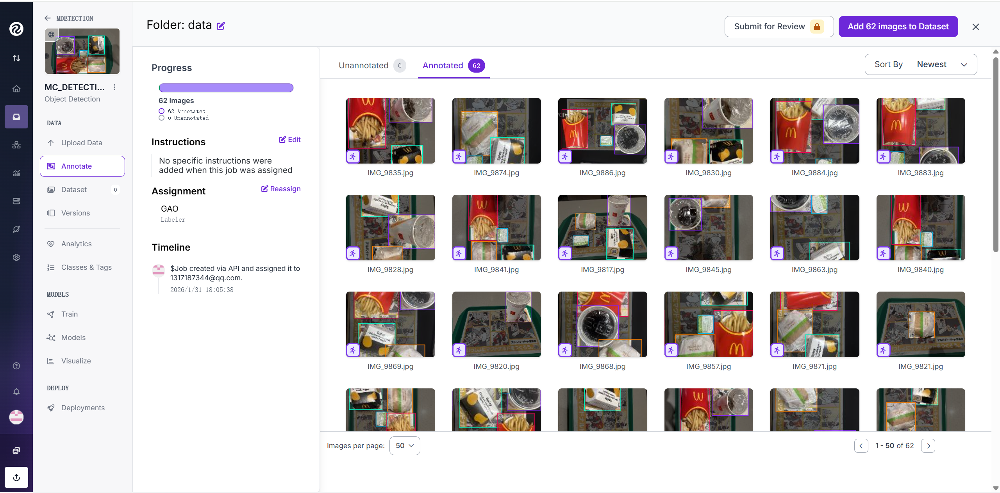
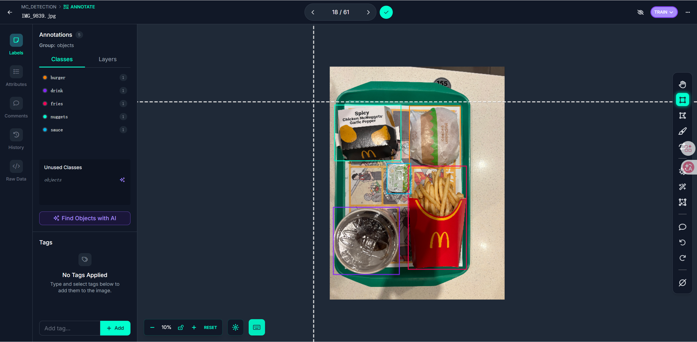
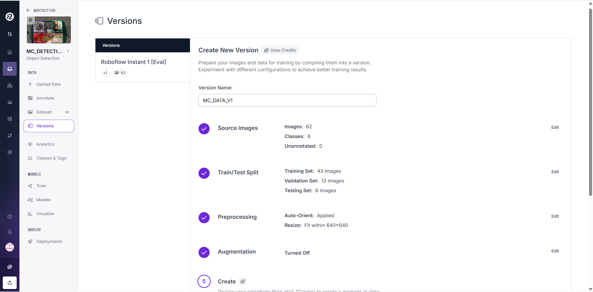
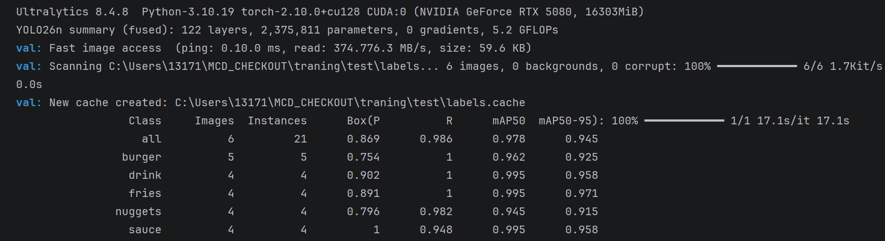

# マクドナルド出庫確認システム（YOLO26ベース）


## Summary
本プロジェクトは、**マクドナルド店舗における出庫確認**を想定した  
物体検出ベースのデモシステムである。

トレイ上の画像に対して YOLO26 を用いた物体検出を行い、  
検出結果と注文データを比較することで、

- 注文に対して **不足している商品**
- 注文に含まれていない **余分な商品**

を判定する。

本プロジェクトは、**デモ用途・学習用途**を目的とし、  
再現可能な処理パイプラインを重視して設計されている。

**以下は、本システムの基本的な処理の流れである。**
1. 注文データ（JSON）を読み込み
2. トレイ画像に対して物体検出を実行
3. 検出結果を商品ごとに集計
4. 注文内容と比較し、不足・余分を判定

### 起動方法
本プロジェクトでは、Streamlit を用いて  
注文と画像入力 → 検出 → 注文との照合結果表示 をブラウザ上で操作できる。
```bash
pip install -r requirements.txt
streamlit streamlit run app/streamlit_app.py
```

---
## 1. 使用モデル・ツール
### 1.1 物体検出モデル YOLO（Ultralytics）について

YOLO（You Only Look Once）は、画像中の物体を **単一のニューラルネットワークで高速に検出** する
ワンステージ型の物体検出アルゴリズムである。

Ultralytics YOLO は Python から簡潔に利用でき、
学習済みモデルを用いた推論や、検出結果の可視化（バウンディングボックス描画）を
容易に実装できる点が特徴である。



本プロジェクトでは、Ultralytics が提供する YOLO 系列の公式実装を利用しており、
以下の特徴を持つ。

- 高速な推論が可能で、リアルタイム処理に適している
- 学習・推論・可視化までを統一された API で実装できる
- バウンディングボックス、クラス、信頼度を同時に出力可能

### 1.2 Roboflow

Roboflow は、画像データのアノテーション、クラス管理、データ分割  
（train / valid / test）および形式変換を支援するツールである。   
本プロジェクトでは、Roboflow を用いて商品ごとのバウンディングボックスアノテーションを行い、YOLO 形式のデータセットを作成した。


---
## 2. データ処理
本プロジェクトにおけるデータ処理は、以下の手順で行った。
### 2.1 データ収集
データは、本人がマクドナルドにて購入した商品を撮影した写真63枚を用いて収集した。  
トレイ上に配置された複数の商品が写った画像を対象としている。

### 2.2 アノテーション（Roboflow）


収集した画像を Roboflow にアップロードし、各画像に対して
商品ごとのバウンディングボックスアノテーションを付与した。

アノテーション対象のクラスは以下の 5 種類である。  
**『burger』 『drink』 『fries』『nuggets』『sauce』**    


### 2.3 前処理

アノテーションが完了したら、Roboflow 上で以下の前処理を行った。

- データセットを **train / validation / test** に分割（7 : 2 : 1）
- すべての画像を **640 × 640** にリサイズし、YOLO が処理可能な形式に統一
- データセットを **YOLO26 形式**でエクスポート

最終的なデータ数は以下の通りである。  
**train: 43 images**  
**validation: 13 images**  
**test: 6 images**  

---
## 3. モデル学習
前節で作成したデータセットを用いて、事前に `ultralytics` パッケージをインストールし、Python 上で YOLO クラスを利用して学習を実行している。

学習は以下のコマンドで実行した。
```python
from ultralytics import YOLO

if __name__ == "__main__":
    model = YOLO("yolo26n.pt")

    model.train(
        data="data.yaml",
        epochs=200,
        imgsz=640,
        batch=16,
        device=0,
        workers=4,
        freeze=10,
        lr0=0.002,
        patience=50,
        cache=True,
        project="runs",
        name="yolo26_MCD"
    )
```
### 3.1 モデル パラメータ設定の理由
本プロジェクトでは、小規模なデータセットを用いた出庫確認タスクを想定し、
過学習を抑えつつ安定した検出性能を得ることを目的として学習設定を行った。

モデルには、事前学習済みの **YOLO26** モデルを使用した。
軽量なモデルを用いることで、推論速度と精度のバランスを取り、
デモシステムとして実用的な構成としている。

入力画像サイズは **640×640** とし、YOLO の標準的な設定に合わせることで、
前処理および推論処理との整合性を確保した。

データ数が限られているため、学習回数は最大 **200 epoch** としつつ、
`patience` を設定することで validation 精度が改善しない場合には
早期終了するようにしている。
これにより、無駄な学習や過学習を防止している。

**バッチサイズは 16** とし、小規模データセットにおいても
学習が安定するよう配慮した。

また、`freeze=10` を設定し、バックボーンの初期層を凍結することで、
事前学習で獲得された一般的な特徴表現を保持しつつ、
後段の層のみを本タスクに適応させるファインチューニングを行っている。

初期学習率は比較的低めに設定し、
事前学習済み重みを大きく破壊しないように調整した。

以上の設定により、限られたデータ量においても安定した学習を行い、
出庫確認デモとして十分な検出性能を得ることを目的としている。

### 3.2 学習後の結果と評価
なお、テストデータ数が限られているため、
本評価結果は参考値として位置付けている。
学習完了後、得られた最良モデル（`best.pt`）を用いて、  
評価には Ultralytics YOLO の `val` 機能を使用し、  
学習時とは独立した test データセットを用いて性能評価を行った。
```python
from ultralytics import YOLO

model = YOLO("runs/yolo26_MCD/weights/best.pt")
metrics = model.val(
    data="data.yaml",
    split="test",
    imgsz=640,
    device=0
)
```

以下に、テストデータに対する評価結果の一例を示す。


評価指標として mAP を用い、
出庫確認デモとして実用上問題ない性能を確認した。


---
## 4. システム全体の実装
本プロジェクトでは、学習によって得られた最良モデル（`best.pt`）を、  
推論およびデモアプリケーションから参照しやすいよう、  
リポジトリ直下の `models/` ディレクトリに配置している。

学習用ディレクトリ（`training/`）と推論・アプリケーション用ディレクトリを  
分離することで、
学習環境と実行環境を明確に切り分けた構成としている。
### 4.1 アプリケーション構成


- `streamlit_app.py`（リポジトリ直下）
  Streamlit による Web UI を実装するエントリポイント。
  画像入力（アップロード / demo 選択）、注文入力（demo 注文選択 / 手入力）、
  パイプライン実行、結果表示を担当する。


- `app/src/pipeline.py`
  注文データの読み込み、物体検出、照合処理を統合した処理パイプライン。
  UI から渡された注文と画像パスを受け取り、最終的な判定結果を返す。


- `app/src/vision_yolo.py`
  学習済み YOLO モデル（`models/best.pt`）を用いた推論処理。
  検出クラスの集計に加え、バウンディングボックス付きの可視化画像生成にも対応する。


- `app/src/compare.py`
  注文内容と検出結果を比較し、不足・余分を算出するロジックを実装する。


- `app/src/rules.py`
  現実の運用を想定した業務ルールを定義する。
  例：ナゲット（nuggets）がある場合はソース（sauce）が必須、など。


- `app/demo_images/`
  デモ用の入力画像を格納する。


- `app/orders/`
  デモ用の注文データ（JSON）を格納する。


- `app/outputs/`
  推論結果（可視化画像など）の出力先。

### 4.2 出庫確認ロジック（比較・ルール）

本システムでは、単純な「個数一致」だけでなく、
業務ルールを考慮した照合を行う。

- 不足：注文にあるが検出されない
- 余分：注文にないが検出される
- ルール不足：業務上必須だが不足している付属品

例：ナゲット（nuggets）が検出された場合、ソース（sauce）は必須とし、  
ソースが検出されない場合は「ルール不足」として判定する。  
このようなルールは `app/src/rules.py` に集約しており、  
将来的な仕様変更（メニュー追加、セット構成、サイズ差等）に対応しやすい設計としている。

### 4.3 実業務を想定した場合の応用・対応

本システムは、実店舗における出庫確認業務を
直接自動化する完成形を目指すものではなく、
業務要件を段階的に吸収するための基盤として設計している。

実業務を想定した場合、本システムは以下のような役割を担う。

1. 出庫確認業務の補助・二次チェック  
   本システムは、最終判断を人が行う前段階として、
   注文内容と出庫内容の不一致候補を提示する用途に適している。
   これにより、確認作業の負荷軽減や見落とし防止が期待できる。

2. 業務ルールの明示化・形式知化  
   「ナゲットにはソースが必要」といった暗黙の業務ルールを
   ルールベースとして明示的に定義することで、
   業務知識をコードとして蓄積・共有することが可能となる。

3. 店舗・運用差への対応  
   実際の業務では、店舗ごと・時間帯ごとに
   メニュー構成や運用ルールが異なる場合が多い。
   本システムでは、物体検出モデルとは独立して
   比較・判定ロジックを管理しているため、
   業務ルールの差異を柔軟に吸収できる。

4. 段階的な自動化への移行  
   初期段階では確認補助として利用し、
   十分な運用データが蓄積された後に、
   自動判定範囲を徐々に拡大するといった段階的導入が可能である。

以上のように、本システムは実業務における
「完全自動化」の前段階として機能する基盤を提供することを目的としている。
